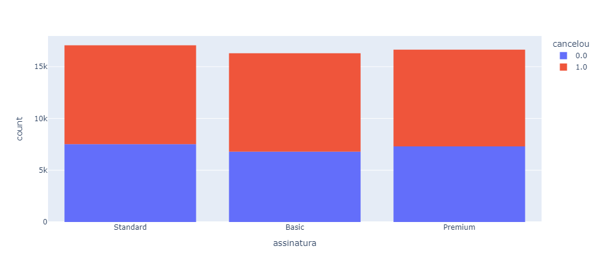
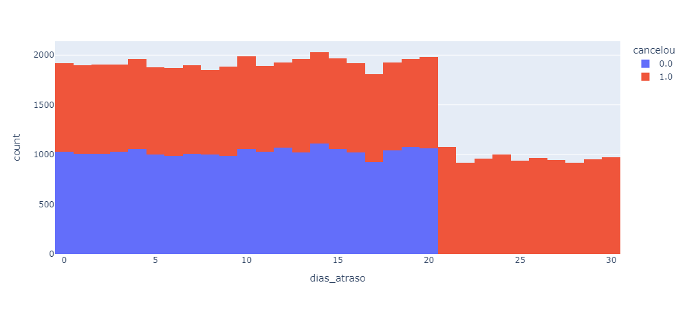
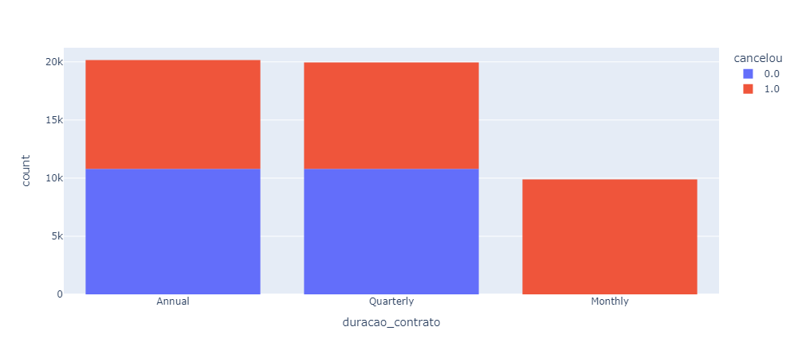
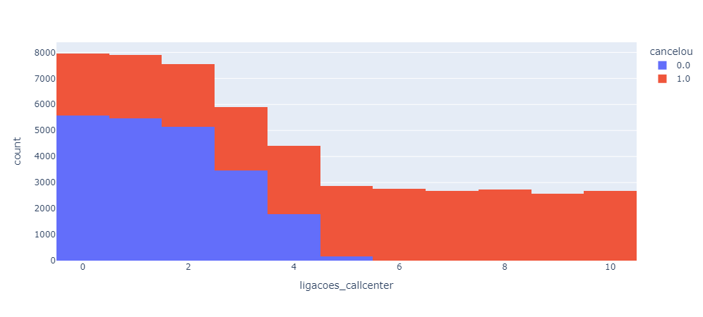

# Sobre
- Projeto de análise de dados para fixação.
- Descrição e resolução do case na análise.

## Tecnologias
- Python 3
- Jupyter
- Bibliotecas Pandas, Plotly, Nbformat

## Gráficos
- Amostra de alguns gráficos gerados pelo Plotly.

